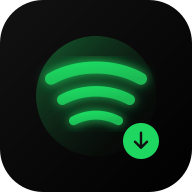

# 🎵 AuraWave - Spotify-Style YouTube Playlist Downloader & Offline Music Player

**AuraWave** is a 100% free, client-side Progressive Web App (PWA) that extracts high-fidelity audio from YouTube playlists & songs and stores them permanently on your iPhone or device for offline playback.



---

## ✨ Features

- 🟢 **Spotify-Inspired Aesthetic**: Pitch black theme, emerald green `#1ed760` accents, fluid bottom navigation, and browse category tiles.
- ⚡ **Full YouTube Search**: Search directly inside the app for songs, artists, albums, or paste any YouTube Playlist URL.
- 🎧 **Highest Audio Quality**: Multi-source audio extraction (Opus / AAC / MP3 up to 320 kbps high-fidelity master bitrate).
- 📲 **100% Offline iPhone App (PWA)**: Saves complete audio tracks and album art to device storage (IndexedDB). Plays in Airplane Mode without internet or cellular data.
- 🎛️ **iOS Lock Screen & Control Center**: Full **MediaSession API** integration with track titles, artist names, artwork, seek controls, and AirPods support.
- 📊 **Real-Time Visualizer**: Live canvas waveform frequency spectrum synchronized to playback.
- 🌐 **Free GitHub Pages Hosting**: Zero backend servers required. 100% static client-side web application.

---

## 🚀 How to Host for Free on GitHub Pages (Step-by-Step)

1. Create a new GitHub repository (e.g., `music_downloader` or `aurawave`).
2. Push all the files in this folder to your repository:
   ```bash
   git init
   git add .
   git commit -m "Initial commit - AuraWave PWA"
   git branch -M main
   git remote add origin https://github.com/YOUR_USERNAME/YOUR_REPOSITORY.git
   git push -u origin main
   ```
3. In your GitHub repository:
   - Go to **Settings** $\rightarrow$ **Pages** (in the left sidebar).
   - Under **Build and deployment** $\rightarrow$ **Branch**, select `main` (or `gh-pages`) and `/ (root)`.
   - Click **Save**.
4. In about 30 seconds, your site will be live at:
   `https://YOUR_USERNAME.github.io/YOUR_REPOSITORY/`

---

## 📱 How to Install the App on your iPhone (100% Free Forever)

> [!TIP]
> No Apple Developer Account ($99/year) or sideloading tools are needed!

1. Open your live GitHub Pages link (e.g. `https://YOUR_USERNAME.github.io/music_downloader/`) in **Safari** on your iPhone.
2. Tap the **Share button** (the blue square with an arrow pointing up at the bottom of Safari).
3. Scroll down and tap **"Add to Home Screen"**.
4. Tap **Add** in the top right corner.
5. The **AuraWave** app icon will now appear on your iPhone home screen!
   - Tapping it opens in **full-screen standalone app mode** (no Safari address bar).
   - Works offline anywhere, anytime.

---

## 🎵 How to Download Music & Play Offline

1. Open the app and tap the **Search** tab at the bottom.
2. Type any song name, artist, or paste a YouTube Playlist URL (e.g. `https://www.youtube.com/playlist?list=...`).
3. Tap the **Download** button on any track, or tap **"Download All"** on a playlist.
4. Go to **Your Library** tab to see and play all your saved offline music.
